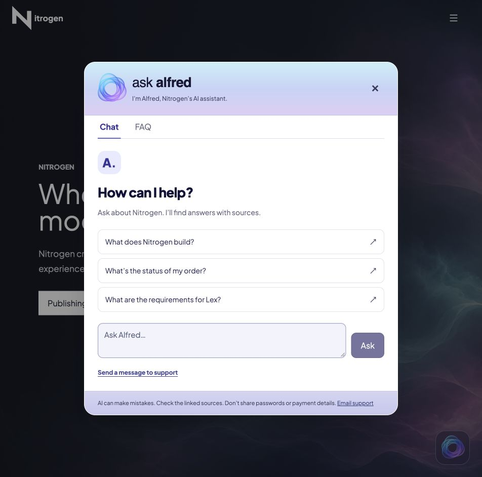
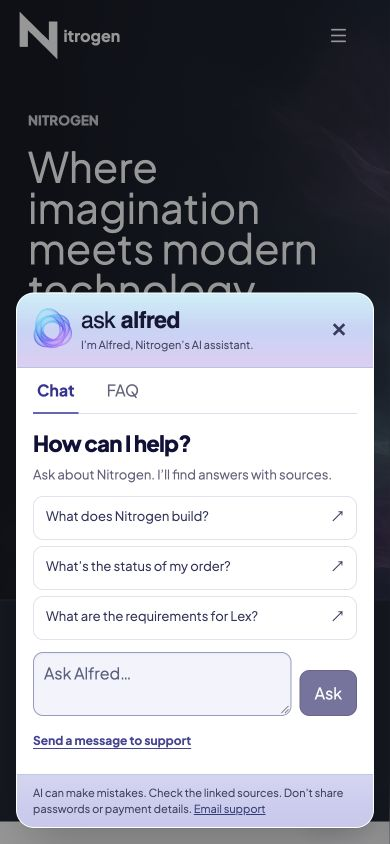

# @nlabs/alfred

A living AI assistant for your website. Alfred provides the UI and conversation flow; your app supplies the knowledge and connectivity.

Built with React 19, GothamUI, and ArkhamJS. Includes the flowing translucent Alfred logo, still-image fallback, accessible modal, Chat/FAQ tabs, citations, and optional support handoff.

## Install

```sh
npm install @nlabs/alfred @nlabs/gothamui @nlabs/arkhamjs @nlabs/arkhamjs-utils-react @nlabs/metropolisjs react react-dom
```

Use your existing GothamUI/ArkhamJS provider and Tailwind v4 setup. Alfred reads the Flux instance with `useFlux`, so mount it within `FluxProvider` from `@nlabs/arkhamjs-utils-react`. Do not create a second store when your app already supplies one. Initialize GothamUI’s exported `i18n` with `initReactI18next` if your app does not already initialize it (see `examples/basic/src/index.tsx`). Import Alfred's CSS after GothamUI/base styles:

```tsx
import {useMemo} from 'react';
import {Alfred} from '@nlabs/alfred';
import {useFlux} from '@nlabs/arkhamjs-utils-react';
import {createConnectivity} from './alfredConnectivity';
import '@nlabs/alfred/styles.css';

// Mount inside your existing ArkhamJS FluxProvider.
export const Assistant = () => {
  const flux = useFlux();
  const connectivity = useMemo(() => createConnectivity(flux), [flux]);

  return <Alfred
    branding={{description: 'Your product assistant'}}
    connectivity={connectivity}
    context="your-product"
    language="en-US"
    name="Alfred"
  />;
};
```

`createConnectivity` is defined below in your app, not exported by Alfred. Keep `connectivity` and `knowledge` referentially stable (module constants or `useMemo`) so rendering does not reset the conversation. Changing `context` or knowledge identity clears previous context and cancels/ignores its pending results. Use distinct `instanceId` values for multiple assistants; omitted IDs are generated automatically.

## Knowledge and connectivity

Alfred does not ingest documents, choose a model, or retrieve private data. `knowledge` is optional opaque metadata/public content passed to your callbacks. Your backend chooses how to retrieve evidence and generate answers.

Chat receives `{context, history, knowledge, language, name, question, signal}` and returns `{answer, sources?: [{title, url}]}`. History is bounded to the last six turns and each text is limited to 2,500 characters. Questions have a 1,200-character limit. Only HTTP(S) source links are displayed. Responses are rendered as text.

For NLabs apps, implement callbacks through MetropolisJS/Rip-Hunter. Other apps can use their own SDK. Pass cancellation to your client where supported; Alfred also ignores obsolete responses.

### What does the knowledge object look like?

`knowledge?: unknown` deliberately has no fixed schema. Your app and backend define its shape. It is optional: omit it if your backend selects the corpus from the authenticated app or `context`. For the MetropolisJS GraphQL adapter, use JSON-serializable values.

A reference to server-managed documents is usually preferable to sending a full document corpus from the browser. Here is an **example contract for your own backend**:

```tsx
// ProductAssistant.tsx
import {useMemo} from 'react';
import {Alfred} from '@nlabs/alfred';
import {useFlux} from '@nlabs/arkhamjs-utils-react';
import {createConnectivity} from './alfredConnectivity';

// Your app defines this shape; these are example fields, not Alfred options.
type ProductKnowledge = {
  collection: string;
  filters: {product: string; visibility: 'public'};
};

// A module constant keeps the object identity stable across renders.
const knowledge: ProductKnowledge = {
  collection: 'product-docs',
  filters: {product: 'your-product', visibility: 'public'},
};

// Mount inside your existing FluxProvider; see the complete adapter below.
export const ProductAssistant = () => {
  const flux = useFlux();
  const connectivity = useMemo(() => createConnectivity(flux), [flux]);
  return <Alfred
    connectivity={connectivity}
    context="your-product"
    knowledge={knowledge}
  />;
};

// Your custom Reaktor backend must validate this shape, map collection to an
// allowed corpus, apply filters, retrieve matching documents and generate an
// answer with sources. Passing the object alone does not implement retrieval.
```

| Field in this example | Meaning in your custom backend |
| --- | --- |
| `collection` | A reference your server maps to an allowed document corpus. |
| `filters.product` | A product scope your retrieval implementation applies. |
| `filters.visibility` | An example filter; the server independently enforces access. |

These are example fields, not built-in Alfred options. Alfred does not interpret them, crawl URLs, upload documents, build an index or authorize a collection. The flow is: **host prop → callback → MetropolisJS action → backend validation/retrieval → answer and sources**. The complete adapter below forwards `knowledge` to chat, FAQ and support operations; your backend can use or ignore it for each operation.

If your own adapter uses small public content directly, you can instead define a shape such as `{documents: [{title: 'Getting started', text: 'Install the package…', url: 'https://example.com/docs'}]}`. Your callback/backend must explicitly read `documents`; this is also not a built-in retrieval feature. Keep provider credentials and private documents on the server. Never treat browser-provided collection IDs or filters as authorization.

**NitrogenX’s current integration:** the host omits `knowledge`. The server loads its maintained corpus and uses `context` to focus source selection. Its current chat parser does not consume the `knowledge` field, so sending `{collection: ...}` to the public `api.reaktor.io` deployment does not select or create a corpus. A custom knowledge contract requires backend implementation and configuration.

`context` is the separate string that identifies the assistant’s focus. Define `knowledge` outside the component, or use `useMemo` keyed by product/collection changes. A new object on every render resets the conversation; changing either context or knowledge identity clears previous turns and ignores obsolete results.

### A complete backend adapter

Save this as `alfredConnectivity.ts`. The MetropolisJS assistant action sends GraphQL operations through Rip-Hunter to Reaktor’s assistant API. Configure `app.api.public` for your Reaktor deployment and configure the host origin and knowledge on the server. The browser does not send provider keys. Alfred itself remains transport-independent; this host adapter supplies the Reaktor connection.

```ts
// alfredConnectivity.ts — your app's MetropolisJS adapter
import {createAction} from '@nlabs/metropolisjs/utils';
import type {FluxFramework} from '@nlabs/arkhamjs';
import type {AlfredConnectivity} from '@nlabs/alfred';

// Optional metadata keeps this adapter compatible with Alfred 0.1 and 0.2.
type Identity = {language?: string; name?: string};
type ChatInput = Parameters<AlfredConnectivity['chat']>[0] & Identity;
type FaqInput = Parameters<NonNullable<AlfredConnectivity['loadFaqs']>>[0] & Identity;
type SupportInput = Parameters<NonNullable<AlfredConnectivity['submitSupport']>>[0] & Identity;

// Configure app.api.public in your Metropolis environment configuration:
// app: {api: {public: 'https://api.reaktor.io'}}
// Requires @nlabs/metropolisjs 1.6.0 or later.
export const createConnectivity = (flux: FluxFramework): AlfredConnectivity => {
  const assistant = createAction('assistant', flux);
  return {
    chat: ({context, history, knowledge, language, name, question}: ChatInput) =>
      assistant.chat({context, history, knowledge, language, name, question}),
    // Omit loadFaqs to hide the FAQ tab.
    loadFaqs: async ({context, knowledge, language, name}: FaqInput) =>
      (await assistant.faqs({context, knowledge, language, name})).items,
    // Omit submitSupport to hide the support form.
    submitSupport: ({confirmed, context, draft, knowledge, language, name, requestId}: SupportInput) =>
      assistant.submitSupport({
        ...draft, confirmed, context, knowledge, language, name, requestId,
      }),
  };
};
// MetropolisJS owns the GraphQL requests, scoped Flux state and success/error events.
// Listen with flux.on(ASSISTANT_CONSTANTS.CHAT_SUCCESS, handler).
// Import ASSISTANT_CONSTANTS from @nlabs/metropolisjs/stores.
// Host credentials and knowledge authorization stay on the server.
```

This adapter does not forward `AbortSignal` to the HTTP client. Alfred still ignores obsolete responses; forward each callback's `signal` if your client supports cancellation.

### Optional FAQs

Omit `loadFaqs` from the adapter to hide the FAQ tab. Return an array of `{id, question, answer, sources: [{title, url}]}`. Loading failures expose a retry; up to 15 items are displayed. If your server wraps the array (for example `{items: [...]}`), unwrap it in your callback.

### Optional support

Omit `submitSupport` to hide the support form. `draft` includes first/last name, email, phone, company, and message. Return `{ticketNumber}` for confirmed delivery or `{queued: true}` for durable acceptance with delivery pending. A failed/ambiguous submission locks details and retains the same request ID for retry. Your backend must implement idempotency and actual durable delivery. The package does not send emails or create CRM records by itself.

## Initial configuration

Set `name` and `language` on each Alfred instance when you mount it:

```tsx
<Alfred
  connectivity={connectivity}
  context="your-product"
  language="en-US"
  name="Alfred"
/>
```

Both props are optional: `name` defaults to `Alfred` and `language` to `en-US`. The name is used in the launcher, modal title, greeting, chat author, FAQ notices, input placeholder, and accessible labels. Header and launcher names remain lowercase; other copy preserves your capitalization.

`language` is a BCP 47 language tag, such as `en-US` or `en-GB`. Alfred marks its UI with this language and passes `language` and `name` to every chat, FAQ, and support callback. Your backend must use the language when generating answers or loading localized FAQs. Built-in UI strings currently remain English; setting this prop does not automatically translate them or change the host application's global i18n settings.

To follow your app's GothamUI language, pass `i18n.resolvedLanguage || i18n.language || 'en-US'` (where `i18n` is exported by `@nlabs/gothamui`). Use GothamUI's `useTranslation` in the host component if it must react to language changes. You can also pass your MetropolisJS app locale. Multiple assistants can have different names and languages. Changing either value clears that instance's conversation and cancels/ignores its pending requests.

The exported `createAlfredController` also accepts an optional fourth argument: `{name: 'Alfred', language: 'en-US'}`.

## Branding and theme

`branding` supports `description`, `email`, `prompts`, `welcomeTitle`, `welcomeDescription`, and `supportSuccess`. `theme` supports CSS values for `accent`, `header`, and `footer`. The default Alfred artwork is retained when you customize the name. Import `AlfredLogo` separately to reuse the animated mark:

```tsx
import {AlfredLogo} from '@nlabs/alfred';
<AlfredLogo active className="my-logo-size" />
```

Give the logo a width and height. Animation pauses when inactive or the document is hidden. Reduced motion and animation failure use the original still. Conversation state is stored through scoped ArkhamJS actions and Flux events; credentials and backend authorization stay with your app.

## NitrogenX in use




[Documentation](https://alfred.nitrogenx.co) · [Source](https://github.com/nitrogenlabs/alfred)

## Development

```sh
npm install
npm test
npm run typecheck
npm run lint
npm run build
npm pack
node scripts/verify-consumer.mjs # installs the packed example and runs Playwright
npm start # opens the prepared example on localhost:3301
```

Lex handles compilation, linting, Vitest unit tests, and Playwright browser tests. Project unit-test settings and coverage thresholds live in `lex.config.mjs`; browser-test settings live in `playwright.config.ts`. Lex supplies the underlying tools, so they do not need separate development dependencies. `npm run typecheck` uses the TypeScript compiler supplied by Lex. The package ships ESM, TypeScript declarations, CSS, and local assets. Use the NitrogenX integration and installed tarball consumer to verify desktop/mobile happy paths with Playwright.

## Updating and publishing

The root package and basic example override DOMPurify to 3.4.16 because Monaco pins an affected version. As of October 3, 2026, `npm audit` still reports the unpatched [`http-cache-semantics` advisory](https://github.com/advisories/GHSA-ch52-4w7c-c8xp) through Lex's tooling dependencies. Its latest release, 4.2.0, is affected; recheck for an upstream fix when updating Lex. Avoid `npm audit fix --force`, which currently suggests downgrading Lex to 1.x and reintroduces other findings.

`npm run update` uses Lex’s interactive dependency updater. Review and test dependency changes before committing them.

For a new release from a clean, committed checkout:

```sh
npm run publish:patch # bug fixes: 0.2.0 → 0.2.1
npm run publish:minor # features: 0.2.0 → 0.3.0
npm run publish:major # breaking changes: 0.2.0 → 1.0.0
```

Choose one command. Each follows the GothamUI/MetropolisJS/Reaktor convention: `npm version` creates the version commit and Git tag, `publish:tags` pushes tags and the current branch, then `npm publish` runs the existing test/build gate and publishes with public access. npm may require browser/2FA authentication. `npm run publish:tags` is also available separately.

If the version has already been bumped (such as the prepared `0.2.0` release), use `npm publish --access public` directly to publish that version without another bump. If npm authentication interrupts a release after the Git push, retry `npm publish` for the same version rather than rerunning the bump command.

MIT. Outfit font is licensed under the SIL Open Font License; see the bundled font license.
